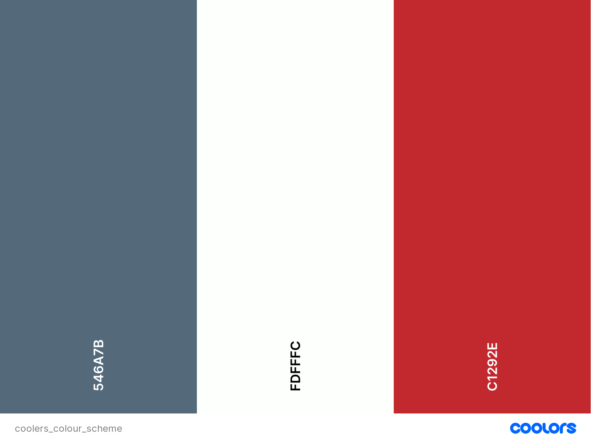
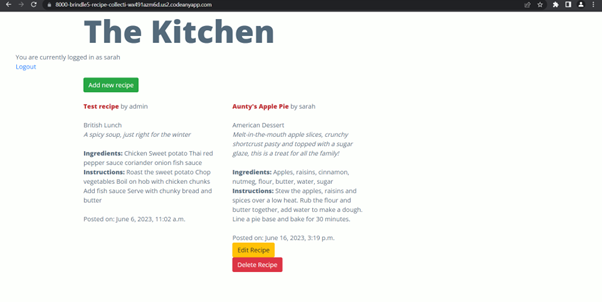
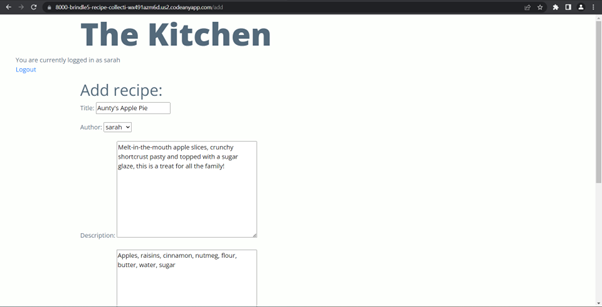
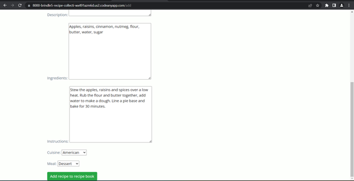
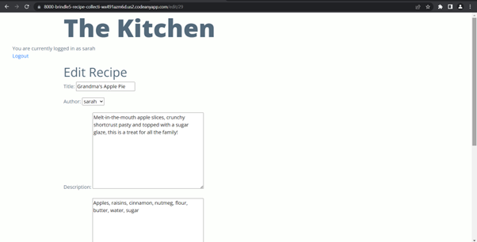
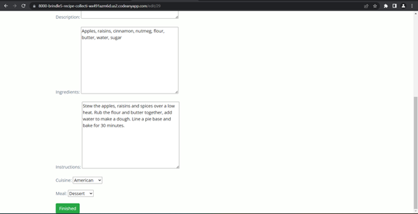
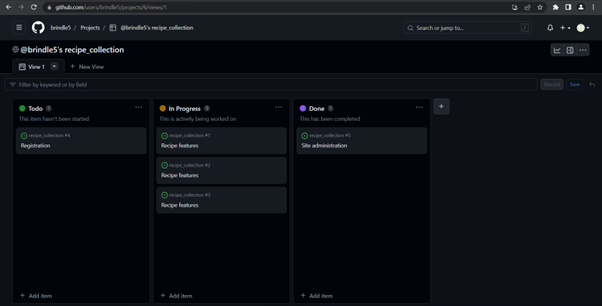
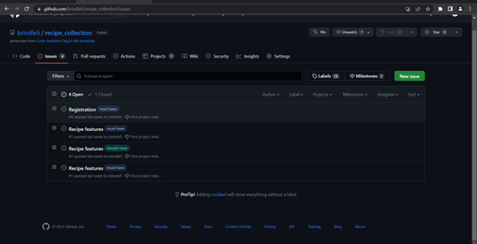
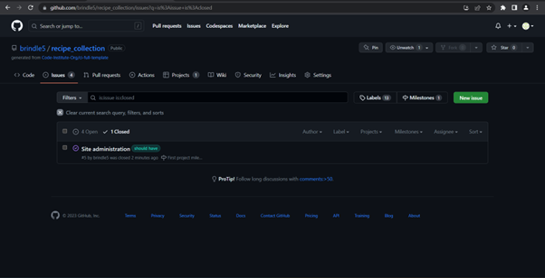

# The Kitchen

‘The Kitchen’ is a site where lovers of food and cooking can upload recipes to their online Recipe Book. They can categorise their recipes by cuisine and meal type.

## UX

### Colour scheme

I used #FDFFFC(Baby Powder) as my background colour and #546A7B(Payne’s Gray) as my font colour. I also used #C1292E(Fire engine red) as a highlight for each recipe title.
I used [coolors.co](https://coolors.co/546a7b-fdfffc-c1292e) to generate my colour palette.



### Typography

[Open Sans](https://fonts.google.com/specimen/Open+Sans) was used to style the text. I used font weight 800 for the recipe headings and font weight 400 for the main text body.

## User stories

### New Site Users

As a site user, I can upload my recipes so that I can keep a permanent record of them.

As a site user, I can register an account so that I can store my recipes in my online recipe book.

As a site user, I can edit and delete recipes so that I can keep my recipes organised.

### Site Admin

As a site administrator, I can manage recipes so that the site is well organised.

## Wireframes

## Features

### Existing features

- **The Kitchen homepage**
On this page, the user can see all the recipes stored in their online recipe book. These can be recipes belonging to the user, or those of other users. From this page, users can select from different options, including adding a new recipe, editing an existing recipe or deleting it entirely.



- **Add new recipe**
Users can add new recipes by completing the form with details of the dish. They can also select type of food, and meal it’s served for.




- **Edit recipe**
The user can edit an existing recipe on this page. The relevant form fields are prepopulated with the recipe data so the user can change one or two small details without having to rewrite their recipe from scratch.




### Future features

There are a number of features which could be added to expand on the site and give it further interactive features. This could include:
•	The ability to like recipes.
•	Commenting on recipes.
•	Attaching photos to recipes to enhance UX.
•	Sharing feature to enable recipes to be sent via social media or messaging services.
•	The ability to add and remove friends.
•	The ability to follow popular recipe builders. 

## Tools and technologies used

- [HTML](https://en.wikipedia.org/wiki/HTML) used for the main site content.
- [CSS](https://en.wikipedia.org/wiki/CSS) used for the main site design and layout.
- [JavaScript](https://www.javascript.com) used for notifications.
- [Python](https://www.python.org) used as the back-end programming language.
- [Git](https://git-scm.com) used for version control. (`git add`, `git commit`, `git push`)
- [GitHub](https://github.com) used for secure online code storage.
- [Bootstrap](https://getbootstrap.com) used as the front-end CSS framework for modern responsiveness and pre-built components.
- [Django](https://www.djangoproject.com) used as the Python framework for the site.
- [Django-allauth](https://django-allauth.readthedocs.io/en/latest/) used to provide registration functionality.
- [ElephantSQL](https://www.elephantsql.com) used as the Postgres database.
- [Heroku](https://www.heroku.com) used for hosting the deployed back-end site.
- [Cloudinary](https://cloudinary.com) used for online static file storage.
- [WhiteNoise](https://whitenoise.readthedocs.io/en/latest/) used for serving static files.


## Database design

## Agile development process

### Github projects

I used  [GitHub Projects](https://github.com/brindle5/recipe_collection/projects) as an Agile tool. I created user stories, issues, and milestone tasks which were tracked on a basic kanban board.



### GitHub Issues

I also used [GitHub Issues](https://github.com/brindle5/recipe_collection/issues) as an another Agile tool. I created my own **User Story Template** to manage user stories which I allocated to milestone iterations.





### MoSCoW Prioritisation

 I applied MoSCow prioritization and labels to my user stories within the Issues tab.

- **Must Have:** guaranteed to be delivered:

•	As a site user, I can upload my recipe so that I can keep a permanent record of them.
•	As a site user, I can edit and delete recipes so that I can keep my recipes organised.
•	As a site user, I can register an account so that I can store my recipes in my online recipe book.

- **Should Have:** adds significant value, but not vital 

•	As a site administrator, I can manage recipes so that the site is well organised.
•	As a site user, I can upload pictures of my recipes so that I can provide a visual accompaniment to my content (During the development process, the MoSCoW labelling of this User Story was downgraded to ‘Won’t have’. It will be included in a future iteration)

- **Could Have:** has small impact if left out 

There were no user stories placed in this category

- **Won't Have:** not a priority for this iteration

As a site user, I can upload pictures of my recipes so that I can provide a visual accompaniment to my content.(Downgraded from ‘Should have.’)

## Testing

For all testing, please refer to the [TESTING.md](TESTING.md) file.

## Deployment 

The live deployed application can be found deployed on [Heroku](https://the-kitchen.herokuapp.com).

### ElephantSQL Database

This project uses [ElephantSQL](https://www.elephantsql.com) for the PostgreSQL Database.

To obtain your own Postgres Database, sign-up with your GitHub account, then follow these steps:

- Click **Create New Instance** to start a new database.
- Provide a name (this is commonly the name of the project: recipe_collection).
- Select the **Tiny Turtle (Free)** plan.
- You can leave the **Tags** blank.
- Select the **Region** and **Data Center** closest to you.
- Once created, click on the new database name, where you can view the database URL and Password.

### Cloudinary API

This project uses the [Cloudinary API](https://cloudinary.com) to store media assets online, due to the fact that Heroku doesn't persist this type of data.

To obtain your own Cloudinary API key, create an account and log in.

- For *Primary interest*, you can choose *Programmable Media for image and video API*.
- Optional: *edit your assigned cloud name to something more memorable*.
- On your Cloudinary Dashboard, you can copy your **API Environment Variable**.
- Be sure to remove the `CLOUDINARY_URL=` as part of the API **value**; this is the **key**.

### Heroku Deployment

This project uses [Heroku](https://www.heroku.com), a platform as a service (PaaS) that enables developers to build, run, and operate applications entirely in the cloud.

Deployment steps are as follows, after account setup:

- Select **New** in the top-right corner of your Heroku Dashboard, and select **Create new app** from the dropdown menu.
- Your app name must be unique, and then choose a region closest to you (EU or USA), and finally, select **Create App**.
- From the new app **Settings**, click **Reveal Config Vars**, and set your environment variables.

| Key | Value |
| --- | --- |
| `CLOUDINARY_URL` | user's own value |
| `DATABASE_URL` | user's own value |
| `DISABLE_COLLECTSTATIC` | 1 (*this is temporary, and can be removed for the final deployment*) |
| `SECRET_KEY` | user's own value |

Heroku needs two additional files in order to deploy properly.

- requirements.txt
- Procfile

You can install this project's **requirements** (where applicable) using:

- `pip3 install -r requirements.txt`

If you have your own packages that have been installed, then the requirements file needs updated using:

- `pip3 freeze --local > requirements.txt`

The **Procfile** can be created with the following command:

- `echo web: gunicorn app_name.wsgi > Procfile`
- *replace **app_name** with the name of your primary Django app name; the folder where settings.py is located*

For Heroku deployment, follow these steps to connect your own GitHub repository to the newly created app:

Either:

- Select **Automatic Deployment** from the Heroku app.

Or:

- In the Terminal/CLI, connect to Heroku using this command: `heroku login -i`
- Set the remote for Heroku: `heroku git:remote -a app_name` (replace *app_name* with your app name)
- After performing the standard Git `add`, `commit`, and `push` to GitHub, you can now type:
  - `git push heroku main`

The project should now be connected and deployed to Heroku!

### Local Deployment

This project can be cloned or forked in order to make a local copy on your own system.

For either method, you will need to install any applicable packages found within the *requirements.txt* file.

- `pip3 install -r requirements.txt`.

You will need to create a new file called `env.py` at the root-level,
and include the same environment variables listed above from the Heroku deployment steps.

Sample `env.py` file:

```python
import os

os.environ.setdefault("CLOUDINARY_URL", "user's own value")
os.environ.setdefault("DATABASE_URL", "user's own value")
os.environ.setdefault("SECRET_KEY", "user's own value")

# local environment only (do not include these in production/deployment!)
os.environ.setdefault("DEBUG", "True")
```

Once the project is cloned or forked, in order to run it locally, you'll need to follow these steps:

- Start the Django app: `python3 manage.py runserver`
- Stop the app once it's loaded: `CTRL+C` or `⌘+C` (Mac)
- Make any necessary migrations: `python3 manage.py makemigrations`
- Migrate the data to the database: `python3 manage.py migrate`
- Create a superuser: `python3 manage.py createsuperuser`
- Load fixtures (if applicable): `python3 manage.py loaddata file-name.json` (repeat for each file)
- Everything should be ready now, so run the Django app again: `python3 manage.py runserver`

#### Cloning

You can clone the repository by following these steps:

1. Go to the [GitHub repository](https://github.com/brindle5/recipe_collection)
2. Locate the Code button above the list of files and click it
3. Select if you prefer to clone using HTTPS, SSH, or GitHub CLI and click the copy button to copy the URL to your clipboard
4. Open Git Bash or Terminal
5. Change the current working directory to the one where you want the cloned directory
6. In your IDE Terminal, type the following command to clone my repository:
	- `git clone https://github.com/brindle5/recipe_collection.git`
7. Press Enter to create your local clone.

Alternatively, if using Gitpod, you can click below to create your own workspace using this repository.

[](https://gitpod.io/#https://github.com/brindle5/recipe_collection)

Please note that in order to directly open the project in Gitpod, you need to have the browser extension installed.
A tutorial on how to do that can be found [here](https://www.gitpod.io/docs/configure/user-settings/browser-extension).

#### Forking

By forking the GitHub Repository, we make a copy of the original repository on our GitHub account to view and/or make changes without affecting the original owner's repository.
You can fork this repository by using the following steps:

1. Log in to GitHub and locate the [GitHub Repository](https://github.com/brindle5/recipe_collection)
2. At the top of the Repository (not top of page) just above the "Settings" Button on the menu, locate the "Fork" Button.
3. Once clicked, you should now have a copy of the original repository in your own GitHub account!

### Local vs Deployment

## Credits

### Content

### Media

### Acknowledgements

- I would like to thank my Code Institute mentor, [Tim Nelson](https://github.com/TravelTimN) for his invaluable support and guidance.
- I would like to thank the [Code Institute](https://codeinstitute.net) tutor team for their assistance with troubleshooting and debugging some project issues.
- I’d like to thank my family and friends for supporting me through the challenges of this project.
