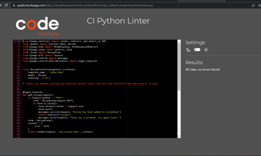
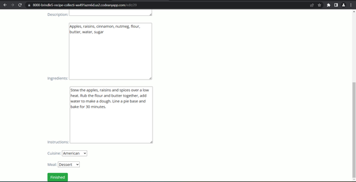

# Testing

Return back to the [README.md](README.md) file.

## Code Validation

### HTML

I have used the recommended [HTML W3C Validator](https://validator.w3.org) to validate all of my HTML files.

[Homepage](https://validator.w3.org/nu/?showsource=yes&doc=http%3A%2F%2Fthe-kitchen.herokuapp.com%2F) | No errors

[Add Recipe Page]( https://validator.w3.org/nu/?showsource=yes&doc=http%3A%2F%2Fthe-kitchen.herokuapp.com%2Fadd) | No errors

[Edit Recipe Page](https://validator.w3.org/nu/?showsource=yes&doc=http%3A%2F%2Fthe-kitchen.herokuapp.com%2Fedit%2F1) | No errors

### CSS

I have used the recommended [CSS Jigsaw Validator](https://jigsaw.w3.org/css-validator) to validate my CSS file which passes with no errors. The report can be found [here](https://jigsaw.w3.org/css-validator/validator?uri=https%3A%2F%2Fthe-kitchen.herokuapp.com).

### JavaScript

I have used the recommended [JShint Validator](https://jshint.com) to validate the small amount of JavaScript code I’ve used.

### Python

I ran my python code through the Code Institute Python Linter.

**Recipe book folder**

•	[Forms.py](https://pep8ci.herokuapp.com/https://raw.githubusercontent.com/brindle5/recipe_collection/main/recipebook/forms.py) | No errors

•	[Models.py]( https://pep8ci.herokuapp.com/https://raw.githubusercontent.com/brindle5/recipe_collection/main/recipebook/models.py) | No errors

•	[Urls.py]( https://pep8ci.herokuapp.com/https://raw.githubusercontent.com/brindle5/recipe_collection/main/recipebook/urls.py) | No errors

•	[Views.py](https://pep8ci.herokuapp.com/https://raw.githubusercontent.com/brindle5/recipe_collection/main/recipebook/views.py) | No errors

**The Kitchen folder**

•	[Settings.py]( https://pep8ci.herokuapp.com/https://raw.githubusercontent.com/brindle5/recipe_collection/main/thekitchen/settings.py) | No errors

•	[Urls.py](https://pep8ci.herokuapp.com/https://raw.githubusercontent.com/brindle5/recipe_collection/main/thekitchen/urls.py) | No errors

## Browser Compatibility

I've tested my deployed project on multiple browsers to check for compatibility issues.

**Chrome:** works as expected

**Edge:** works as expected

**Firefox:** works as expected

**Safari:**  works as expected

## Responsiveness

I've tested my deployed project on multiple devices to check for responsiveness issues.

### Mobile phones (screens from 320px to 480px) 

Some slight CSS changes

### Tablet (screens from 481px to 768px)

Works as expected

### Laptop  (screens from 769px to 1024px): 

Works as expected

### Desktop

## Lighthouse Audit

I tested my deployed project using the Lighthouse tool and found there are no major issues.

**Homepage:** No warnings

**Add recipe page:** Some warnings

**Edit Recipe page:** No serious issues

## Defensive Programming

Defensive programming was manually tested with the below user acceptance testing:

User Action - Expected Result - Pass/Fail 

**Home Page (Before login/registration)**

- Click on login – Redirect to ‘sign in’ page - Pass
- Click on register – Redirect to ‘register page’ – Pass

**Login page**

- Username – User is prompted to complete username field - Pass
 - Password - User is prompted to complete password field - Pass
 - User clicks ‘Sign In’ – Redirect to homepage with notification of success - Pass

**Register page**

- Username - User is prompted to enter a username – Pass
- Email address – User is prompted to enter a valid email address – Pass
- Password – User is prompted to enter a password – Pass
- Password (again) – User is prompted to enter their password a second time – Pass
- Click ‘Sign up’ – Redirect to homepage with notification of successful registration - Pass

**Home page (After login/registration)**

- Click on ‘Logout’ - Redirect to ‘Sign Out’ page – Pass (user asked to confirm sign out)
- Click on ‘Add new recipe’ - Redirect to ‘Add Recipe’ page – Pass
- Click on ‘Edit Recipe’ - Redirect to ‘Edit Recipe’ page – Pass
- Click on ‘Delete Recipe' – Recipe deleted from database with notification of success – Pass

**Logout page**

- Click on ‘Sign Out’ – Redirect to homepage with notification of success – Pass

**Add New Recipe page**

- Title field – User is prompted to complete title field – Pass
- Description field – User can complete or leave blank - Pass
- Ingredients field – User is prompted to complete ingredients field -  Pass
- Instructions field – User is prompted to complete instructions field – Pass
- Select cuisine from list – User can choose from dropdown list, or leave blank - Pass
- Select meal from list - User can choose from dropdown list, or leave blank - Pass
- Click on ‘Finished’ – Redirect to homepage with notification of success - Pass
- Click on ‘Return Home’ – Redirect to home page with no changes – Pass

**Edit recipe page**

- Title field- User can change title, or leave as is - Pass
- Description field – User can add or change description, or leave as is - Pass
- Ingredients field – User can change ingredients, or leave as is - Pass
- Instructions field - User can change instructions, or leave as is – Pass
- Cuisine field – User can change or select cuisine type – Pass
- Meal type - User can change or select meal type - Pass
- Click on ‘Finished’ - Redirect to home page with notification of success - Pass
- Click on ‘Return Home’ - Redirect to home page with no changes - Pass

## User Story Testing

All of my site's features fulfil the needs set out in my user stories:

As a site user, I can upload my recipes so that I can keep a permanent record of them.

As a site user, I can register an account so that I can store my recipes in my online recipe book.

As a site user, I can edit and delete recipes so that I can keep my recipes organised.

As a site administrator, I can manage recipes so that the site is well organised.

## Automated Testing

I have conducted a series of automated tests on my application.
I fully acknowledge and understand that, in a real-world scenario, an extensive set of additional tests would be more comprehensive.

### Python (Unit Testing)

## Bugs

### Fixed Bugs

When viewed on a device narrower than 385px, the ‘Add new recipe’ and ‘Edit recipe’ pages had a slight overflow on their x-axis.

To fix this, I added ‘overflow-x: hidden’ to the body section of my css file.

There are no remaining bugs that I am aware of.
