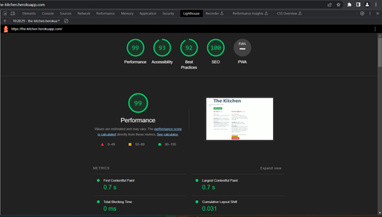

# Testing

Return back to the [README.md](README.md) file.

## Code Validation

### HTML

### CSS

### JavaScript

### Python

## Browser Compatibility

## Responsiveness

### Mobile

### Tablet

### Laptop

### Desktop

## Lighthouse Audit

I tested my deployed project using the Lighthouse tool and found there are no major issues.

**Homepage:** No warnings

**Add recipe page:** Some warnings

**Edit Recipe page:** No serious issues

## Defensive Programming

## User Story Testing

## Automated Testing

## Bugs

