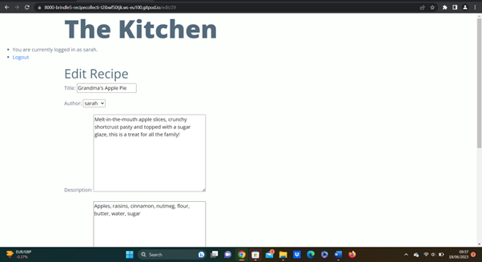
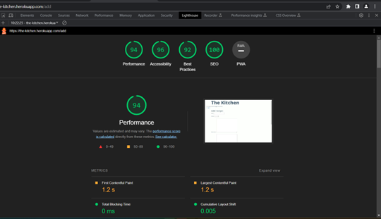
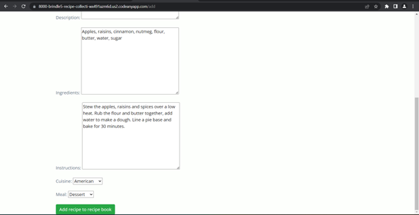
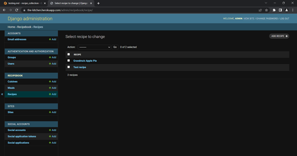

# Testing

Return back to the [README.md](README.md) file.

## Code Validation

### HTML

### CSS

### JavaScript

### Python

## Browser Compatibility

I've tested my deployed project on multiple browsers to check for compatibility issues.

**Chrome:** works as expected

**Edge:** works as expected

**Firefox:** works as expected

## Responsiveness

### Mobile

### Tablet

### Laptop

### Desktop

## Lighthouse Audit

I tested my deployed project using the Lighthouse tool and found there are no major issues.

**Homepage:** No warnings

**Add recipe page:** Some warnings

**Edit Recipe page:** No serious issues

## Defensive Programming

## User Story Testing

All of my site's features fulfil the needs set out in my user stories:

As a site user, I can upload my recipes so that I can keep a permanent record of them.

As a site user, I can register an account so that I can store my recipes in my online recipe book.

As a site user, I can edit and delete recipes so that I can keep my recipes organised.

As a site administrator, I can manage recipes so that the site is well organised.

## Automated Testing

## Bugs

